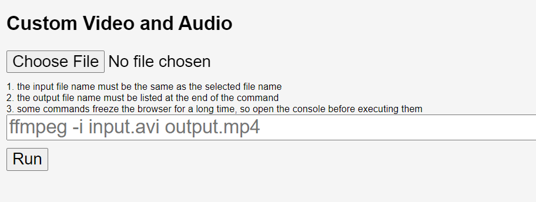

# browser-extension-ffmpeg
[English](./README.md) | 日本語

## 概要
ChromeおよびFirefoxでffmpeg.wasmを使用する簡単な例  
Chrome拡張機能のManifest Version3 に対応しています。

## インストール
ダウンロードしたフォルダのルートには`manifest-v2.json`と`manifest-v3.json`が含まれています。  
使用したいManifest Versionに応じて、`manifest.json`に名前を変更してください。  
必要のないファイルは削除してください。

### Chrome (Edge, Opera, Vivaldi, Brave, etc.)
1. 拡張機能の設定ページを開く（Chromeの場合は [chrome://extensions](chrome://extensions)）
2. 右上の「デベロッパーモード」をオンにする
3. 「パッケージ化されていない拡張機能を読み込む」をクリック
4. このリポジトリのディレクトリを選択

### Firefox
1. "この Firefox"ページを開く（[about:debugging#/runtime/this-firefox](about:debugging#/runtime/this-firefox)）
2. "一時的なアドオンを読み込む..."をクリック
3. `manifest.json`を選択

## 対応状況
| Manifest Version | Chrome | Firefox |
| --- | --- | --- |
| v2 | ✅ | ✅ |
| v3 | ✅ | ❌ |

## 使い方

拡張機能のアイコンをクリックして開いたポップアップページで、「Open Options Page」を選択します。

「convert WebM to MP4」または「convert Wav to MP3」をクリックして、WebM->MP4およびWav->MP3のデモを実行できます。

任意のファイルとコマンドを指定して、変換することもできます。

## ライセンス
MIT

## 参考
- ffmpeg.wasm-core: [https://github.com/ffmpegwasm/ffmpeg.wasm-core](https://github.com/ffmpegwasm/ffmpeg.wasm-core)
- ffmpeg.wasm: [https://github.com/ffmpegwasm/ffmpeg.wasm](https://github.com/ffmpegwasm/ffmpeg.wasm)
- Content Security Policy: [https://developer.chrome.com/docs/extensions/mv3/manifest/content_security_policy/](https://developer.chrome.com/docs/extensions/mv3/manifest/content_security_policy/)
- Sample video source: [https://youtu.be/D6DVTLvOupE](https://youtu.be/D6DVTLvOupE)

