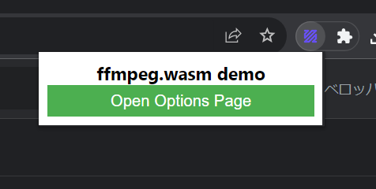
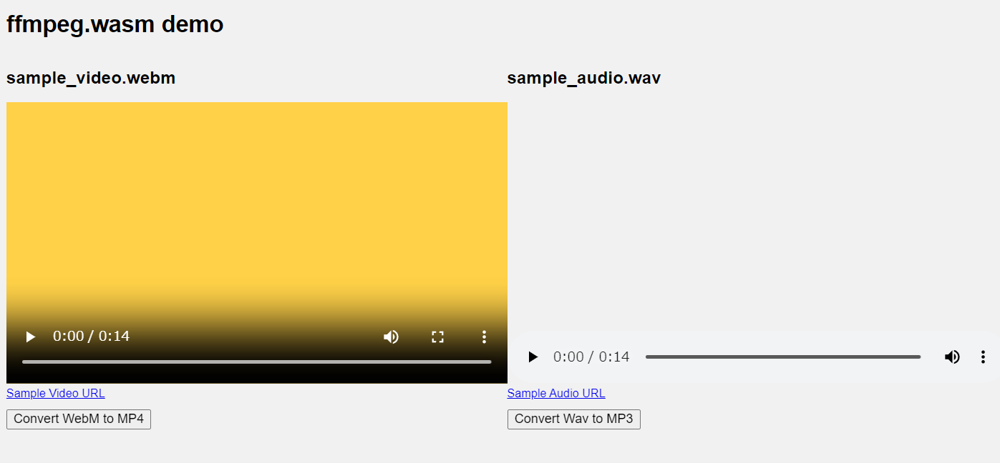
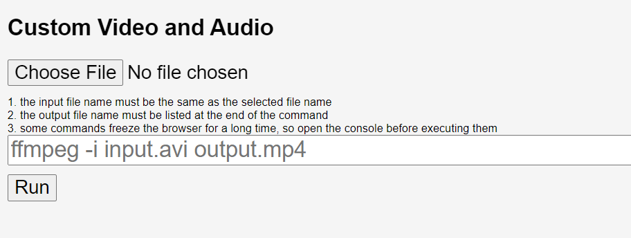

# browser-extension-ffmpeg
English | [日本語](./README-ja.md)  

**ffmpeg.wasm version 0.12.6 is now supported in the dev branch. (Manifest V3 only).**

## Overview
A simple example of using ffmpeg.wasm with Chrome and Firefox extensions.  
Chrome Extension Manifest V3 is supported.

## Installation
Included in the root of the downloaded folder are `manifest-v2.json` and `manifest-v3.json`.  
Depending on the Manifest Version you want to use, rename it to `manifest.json`.  
Delete files that are no longer needed.

### Chrome (Edge, Opera, Vivaldi, Brave, etc.)
1. Open the extensions settings page \(for Chrome, go to [chrome://extensions](chrome://extensions)\)
2. Turn on 'Developer mode' in the top right corner.
3. Click on 'Load unpacked'.
4. Choose this repository's directory.

### Firefox
1. Open the 'This Firefox' page \([about:debugging#/runtime/this-firefox](about:debugging#/runtime/this-firefox)\)
2. Click on 'Load Temporary Add-on…'
3. Select the `manifest.json`

## Compatibility
| Manifest Version | Chrome | Firefox |
| --- | --- | --- |
| v2 | ✅ | ✅ |
| v3 | ✅ | ❌ |

## Usage

Click on the extension icon to open the popup page, then select 'Open Options Page'.

Click on 'convert WebM to MP4' or 'convert Wav to MP3' to run the demos for WebM->MP4 and Wav->MP3 conversions respectively.

You can also specify any file and command to perform the conversion.

## License
MIT (except for sample video and audio)

## References
- ffmpeg.wasm-core: [https://github.com/ffmpegwasm/ffmpeg.wasm-core](https://github.com/ffmpegwasm/ffmpeg.wasm-core)
- ffmpeg.wasm: [https://github.com/ffmpegwasm/ffmpeg.wasm](https://github.com/ffmpegwasm/ffmpeg.wasm)
- Content Security Policy: [https://developer.chrome.com/docs/extensions/mv3/manifest/content_security_policy/](https://developer.chrome.com/docs/extensions/mv3/manifest/content_security_policy/)
- Sample video source: [https://youtu.be/D6DVTLvOupE](https://youtu.be/D6DVTLvOupE)

